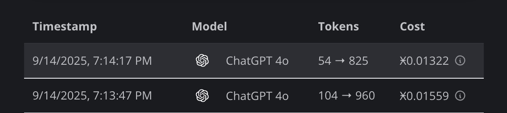
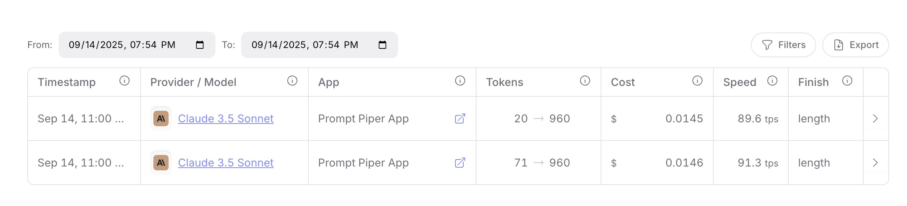

# Prompt Piper

Prompt Piper プロンプト　パイパー | Compress LLM prompts to 4x your context window. Reduce API costs, slash latency, and unlock more powerful AI applications.

## What is Prompt Piper?

Prompt Piper is an intelligent prompt compression platform that helps developers and AI enthusiasts maximize their LLM interactions by:
- **4x your effective context window** - Fit more information into every API call
- **Reduce API costs** - Pay for fewer tokens while maintaining semantic meaning
- **Decrease latency** - Shorter prompts mean faster responses
- **Share compression expertise** - Leverage community-optimized rule sets

**Available as:**
- 🌐 **Web Application** - Interactive browser-based compression tool
- 🖥️ **CLI Tool** - Command-line interface for developers
- 📦 **NPM Package** - `prompt-piper-cli` for global installation
- 🤖 **ElizaOS Plugin** - Integration with AI agent frameworks

## Project Architecture

### 🖥️ CLI Tool (`/cli`) コマンドラインインターフェース
Command-line interface for developers and power users.

**Key Features:**
- Interactive terminal UI with guided workflows
- Direct command-line compression
- IPFS-based rule set sharing and discovery
- Language-specific compression rules (Solidity, Go, Rust, Python, etc.)
- Integration with Claude AI and other LLMs
- Real-time compression analytics

**📦 NPM Package Available:**
The CLI tool is also available as a standalone NPM package for easy installation and global usage:
```bash
npm install -g prompt-piper-cli
# or
bun add -g prompt-piper-cli

# Quick usage
prompt-piper compress "your prompt here"
prompt-piper interactive
```

🔗 **[Install from NPM →](https://www.npmjs.com/package/prompt-piper-cli)**

**Claude Integration:**
The interactive mode supports direct Claude AI integration when run with the `--claude` flag. If Claude is available in your command line environment, compressed prompts will be automatically forwarded to Claude for processing, allowing you to see the AI's response to both original and compressed prompts side-by-side.

**Quick Commands:**
```bash
cd cli && bun install

# Interactive mode
bun run interactive                    # Launch terminal UI
bun run interactive --claude           # Launch with Claude integration (forwards prompts to Claude CLI)

# Direct compression
bun run compress "your prompt here"    # Compress text directly
bun run compress --rules solidity      # Use language-specific rules
bun run compress -f input.txt          # Compress from file

# Analysis & comparison
bun run analyze "your prompt"          # Show compression stats
bun run compare -f prompt.txt          # Before/after comparison

# IPFS rule sets
bun run ipfs:browse                    # Browse available rule sets
bun run ipfs:publish rules.json        # Share your rule set
```

📖 **[Full CLI Documentation →](./cli/README.md)**

### 🌐 Web Application (`/app`) ウェブアプリケーション
Modern web interface with live compression demo and AI integration.

**Built Features:**
- **Live Compression Demo** - Interactive prompt compression with real-time token counting
- **AI Test Panel** - Direct integration with Claude AI and other LLMs
- **Visual Token Analytics** - Before/after comparison with cost savings
- **Multiple Compression Models** - TinyBERT (57MB), BERT (710MB), XLM-RoBERTa (2.2GB)
- **Responsive Design** - Beautiful, modern UI built with Next.js and Tailwind CSS
- **Real-time Processing** - Client-side compression using LLMLingua2.js

**Technology Stack:**
- **Frontend**: Next.js 15, React 18, TypeScript
- **Styling**: Tailwind CSS, Framer Motion animations
- **Compression Engine**: LLMLingua2.js with ONNX Runtime
- **AI Integration**: Anthropic Claude, OpenAI, OpenRouter APIs
- **Deployment**: Cloudflare Pages with automatic builds
- **Token Counting**: Tiktoken for accurate token analysis

**Live Demo:**
```bash
cd app && bun install
bun run dev                    # Start development server
bun run build                  # Build for production
bun run pages:deploy          # Deploy to Cloudflare Pages
```

🌐 **[Try the Live Demo →](https://promptpiper.xyz/)**

## 🎨 Web Application Features

### Live Compression Demo
- **Interactive Interface**: Real-time prompt compression with instant results
- **Multiple Models**: Choose between TinyBERT (fast), BERT (balanced), or XLM-RoBERTa (accurate)
- **Token Analytics**: Visual token counting with before/after comparisons
- **Cost Calculator**: Real-time API cost savings estimation

### AI Integration Panel
- **Direct LLM Testing**: Send compressed prompts directly to Claude AI, OpenAI, or OpenRouter
- **Response Comparison**: Compare AI responses from original vs compressed prompts
- **API Management**: Configure and test multiple AI provider endpoints

### Modern UI/UX
- **Responsive Design**: Works seamlessly on desktop, tablet, and mobile
- **Beautiful Animations**: Smooth transitions powered by Framer Motion
- **Dark/Light Mode**: Adaptive theming for comfortable viewing
- **Accessibility**: Built with accessibility best practices

## Core Technology

### 🎯 Advanced Compression Engine アドバンスド圧縮エンジン
- **LLMLingua2.js Integration** - State-of-the-art prompt compression using transformer models
- **Multiple Model Support** - Choose between speed (TinyBERT) and accuracy (XLM-RoBERTa)
- **Client-side Processing** - No data leaves your browser, ensuring privacy
- **Real-time Token Counting** - Accurate token analysis using Tiktoken
- **Semantic Preservation** - Maintains meaning while reducing token count

### 🌐 Decentralized Rule Sharing (IPFS) 分散型ルールシェアリング
- Publish and discover compression rule sets
- Community-driven optimization patterns
- Version control for rule sets
- No central authority or vendor lock-in

### 📊 Analytics & Insights アナリティクス＆インサイト
- **Real-time Token Metrics** - Live token counting and compression ratios
- **Cost Savings Calculator** - Estimate API cost reductions
- **Visual Comparisons** - Side-by-side before/after analysis
- **Performance Analytics** - Compression speed and effectiveness metrics

### 🤖 Compression Models コンプレッションモデル

| Model | Size | Speed | Accuracy | Use Case |
|-------|------|-------|----------|----------|
| **TinyBERT** | 57MB | ⚡ Fast | ⭐ Good | Quick compression, real-time demos |
| **BERT** | 710MB | 🚀 Balanced | ⭐⭐ Better | Production use, balanced performance |
| **XLM-RoBERTa** | 2.2GB | 🐌 Slower | ⭐⭐⭐ Best | Maximum accuracy, research |

All models run client-side using ONNX Runtime for optimal performance and privacy.

## Getting Started

### 🌐 Web Application (Recommended for Most Users)
Try the live compression demo in your browser:
```bash
cd app
bun install
bun run dev
```
Then visit `http://localhost:3000/demo` for the interactive compression tool, or try the live demo at [https://promptpiper.xyz/](https://promptpiper.xyz/).

### 🖥️ CLI Tool (For Developers & Power Users)
Use the command-line interface for terminal-based workflows:
```bash
cd cli
bun install
bun run interactive
```

### 🚀 Quick Demo
1. **Web App**: Visit [https://promptpiper.xyz/](https://promptpiper.xyz/) and try compressing a prompt
2. **CLI**: Run `bun run interactive` and select example prompts
3. **Compare**: See token reduction and cost savings in real-time

### Integrations
Both CLI and web interfaces support:
- **Claude AI integration** - Direct API calls with compressed prompts
- **OpenAI/OpenRouter** - Multiple LLM provider support
- **Custom endpoints** - Use with any LLM API
- **IPFS rule sets** - Community-driven compression patterns

**🤖 ElizaOS Plugin:**
Prompt Piper is also available as a plugin for the ElizaOS framework, enabling seamless integration with AI agent workflows:
- **Automated prompt compression** - Built into ElizaOS agent interactions
- **Cost optimization** - Reduce token usage across all agent conversations
- **Custom compression rules** - Tailored for specific agent use cases
- **Real-time processing** - Compress prompts on-the-fly during agent operations

🔗 **[ElizaOS Plugin →](https://github.com/shreyanshp/plugin-prompt-piper-openai)**

## Example Compression

```bash
# Original (127 tokens)
"Could you please provide a comprehensive analysis of the following Python code,
including detailed suggestions for performance optimizations, potential security
vulnerabilities, code style improvements, and best practices recommendations?"

# Compressed (23 tokens - 82% reduction!)
"analyze Python code: performance, security, style, best practices"

# Cost Savings: ~$0.002 per request with GPT-4
```

## Compression Results

Here are real-world examples of Prompt Piper's compression effectiveness:

### Claude 3.5 Sonnet Usage Statistics


*Example showing token compression from 20→960 and 71→960 tokens with Claude 3.5 Sonnet, demonstrating significant cost savings and improved efficiency.*

### ChatGPT 4o Usage Statistics  


*Real-world compression results with ChatGPT 4o, showing token transformations from 54→825 and 104→960 tokens, with corresponding cost reductions.*

## Use Cases

- **Software Development**: Compress code snippets, documentation, and technical requests
- **Research & Analysis**: Fit more papers, data, and context into prompts
- **Content Creation**: Include extensive background and style guides
- **Data Science**: Process larger datasets in single API calls
- **Team Collaboration**: Share and optimize prompts across organizations

## Documentation

- 📖 **[CLI Tool Guide](./cli/README.md)** - Complete CLI documentation and usage
- 🌐 **[IPFS Rules System](./cli/IPFS_RULES_README.md)** - Decentralized rule sharing
- 🔧 **[IPFS Setup Guide](./cli/src/ipfs/README.md)** - Installation and configuration
- 📊 **[Compression Examples](./cli/examples/)** - Real-world use cases and demos

## Development

### CLI Development
```bash
cd cli
bun install
bun run dev
bun run build
```

### Web App Development
```bash
cd app
bun install
bun run dev          # Start development server
bun run build        # Build for production
bun run pages:deploy # Deploy to Cloudflare Pages
```

### Project Structure
```
prompt-piper-v/
├── app/                 # Next.js web application
│   ├── app/
│   │   ├── components/  # React components
│   │   ├── demo/       # Live compression demo
│   │   └── lib/        # Compression engine & utilities
│   └── public/         # Static assets
├── cli/                # Command-line interface
│   ├── src/            # TypeScript source
│   ├── bin/            # Executable scripts
│   └── dist/           # Compiled output
└── llmlingua-2-js-main/ # LLMLingua2.js integration
```

### Contributing
We welcome contributions to all parts of the Prompt Piper ecosystem:
- 🐛 **Report Issues**: [GitHub Issues](https://github.com/yourusername/prompt-piper/issues)
- 💡 **Feature Requests**: Share your ideas in discussions
- 🔧 **Code Contributions**: Submit PRs for CLI, web app, or documentation
- 📝 **Rule Sets**: Contribute specialized compression rules via IPFS
- 📖 **Documentation**: Help improve guides and examples

## Roadmap

**✅ Completed Features**
- **CLI Tool**: Interactive terminal interface, command-line compression, IPFS rule sharing
- **Web Application**: Live compression demo, AI integration, responsive design
- **Compression Engine**: LLMLingua2.js integration with multiple model support
- **AI Integration**: Claude AI, OpenAI, OpenRouter API support
- **Deployment**: Cloudflare Pages deployment with automatic builds

**🚧 In Development**
- Enhanced rule set marketplace and browser
- Team collaboration and sharing features
- Advanced analytics dashboard
- API rate limiting and usage tracking
- Mobile-responsive optimizations

**🔮 Future Plans**
- Enterprise deployment options
- Custom model training interface
- Advanced prompt templates
- Integration with popular development tools
- Community-driven rule set marketplace

## License

MIT License - see [LICENSE](LICENSE) for details.

## Acknowledgments

Built with ❤️ by the Prompt Piper community. Special thanks to:
- All contributors and rule set authors
- The IPFS community for decentralized infrastructure
- Claude AI and other LLM providers for inspiring better prompt engineering

---

*Prompt Piper - Compress More, Pay Less, Build Faster*